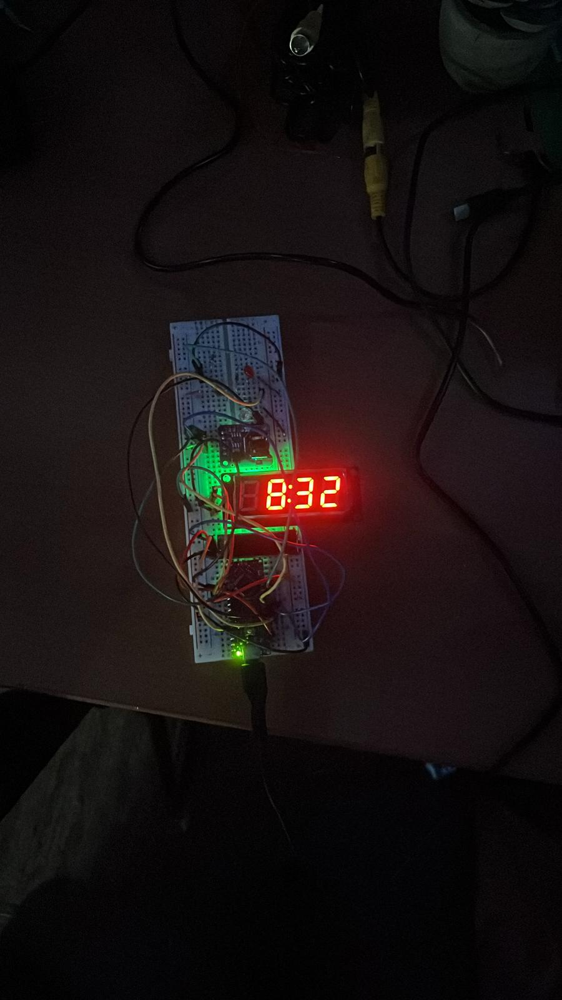

# Arduino Clock Project

The above code was recovered from a breadboarding project that I did last spring (April 2024). I used an Arduino Nano, a real-time clock module to keelo track of time, a 7-segment clock style digital display to display time, LED's to denote AM and PM time, and a photoresistor that allowed for autodimming of the clock display and leds. 

One of the things that I wanted to do after this was attatch an WWVB antenna to fetch to sync the real time over the radio, and potentially display the current time zone on a tiny OLED Display.